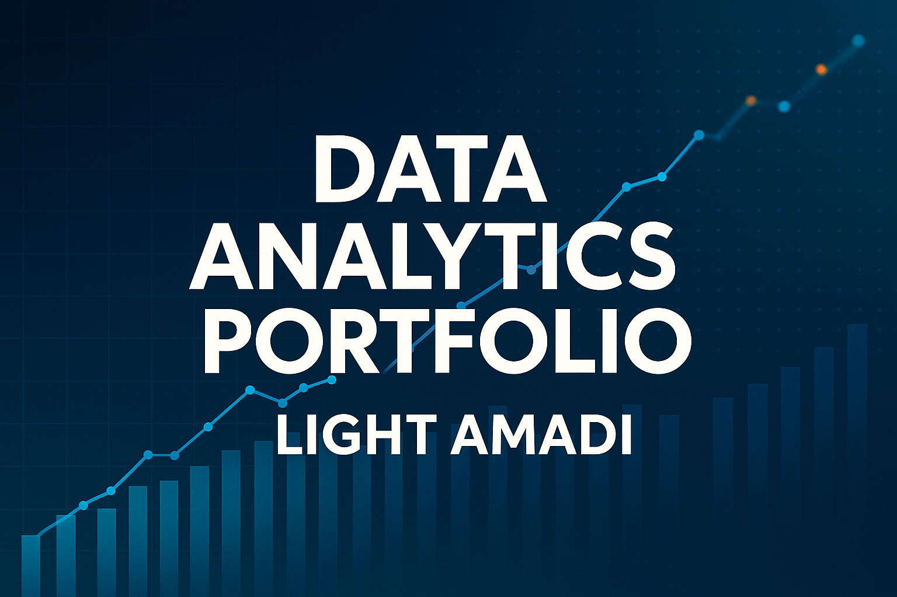

  

# 🌐 Light's Data Analytics Portfolio

Welcome to my Data Analytics Portfolio! 
This portfolio serves as a central hub showcasing my **data analytics projects**. Each project is organized in its own dedicated workspace with links provided below. 

I use **Power BI, SQL, Excel, and strong data visualization** techniques to solve real-world business problems, uncover insights, and support data-driven decisions. Explore the projects to see my analytical thinking, technical execution, and storytelling in action.

---

## 📑 Table of Contents
- [📊 Projects Showcase](#-projects-showcase)
- [🛠 Skills & Tools](#-skills--tools)
- [👤 About Me](#-about-me)
- [📎 Contact](#-contact)

---
## 📊 Projects

- [MOBILE SALES PERFORMANCE ANALYSIS](https://github.com/lightamadi-stack/Mobile-Sales-Performance-Analysis)  
   
  *Thumbnail for visual representation only. Actual dashboard may vary.*  

  📎 [View Mobile Sales Performance Analysis Live Dashboard and Interact with It](https://app.powerbi.com/view?r=eyJrIjoiNDExNjYyY2MtMTZmMi00YWE0LTg4YTItOTliZDhiYzkzZTdjIiwidCI6IjAyMDk2OWQ5LTgyNzMtNGVjOC05Y2YyLTMzYTU1NWM1YmFhMiJ9)  
  Power BI dashboard analyzing mobile phone sales across brands, models, and regions.

- [Project 2 Title](https://github.com/yourusername/Project2)  
  Short description of what it does.

- [Project 3 Title](https://github.com/yourusername/Project3)  
  Short description of what it does.

---

## 🛠 Skills & Tools
- Power BI → Data cleaning, modeling, dashboards  
- SQL → Querying and database management  
- Excel → Advanced analytics and reporting  
- Data Visualization → Interactive charts and insights  
- Business Intelligence → Strategic recommendations  

---

## 👤 About Me
**Light**  
📍 Abuja, Nigeria  
💼 Data Analyst | Power BI Enthusiast  

  

I specialize in transforming raw datasets into actionable insights that drive business decisions. My focus is on **data storytelling, visualization, and business intelligence solutions**.

---

## 📎 Contact
- 🔗 [GitHub](https://github.com/yourusername)  
- 🔗 [LinkedIn](https://linkedin.com/in/yourprofile)  
- 📧 Email: your.email@example.com
